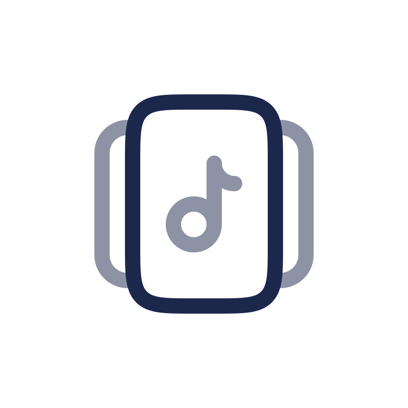

# SteamVoice



SteamVoice 将 Windows 电脑正在播放的系统音频实时传输到同一局域网内的 Android 设备。电脑端通过 WASAPI loopback 捕获默认输出设备，使用 Opus 编码后经 UDP 发送；Android 端以媒体播放前台服务接收、解码并播放音频。

当前版本：`1.1.0`

## 功能

- 自动发现：Android 接收端通过 mDNS/NSD 广播，Windows 端自动扫描可用设备。
- 低延迟传输：48 kHz、双声道 Opus 音频，支持 10 ms 和 20 ms 音频帧。
- 自适应码率：接收端反馈丢包和队列状态，发送端在 48-192 kbps 间自动调整。
- 丢包处理：支持 Opus FEC 与丢包补偿。
- 接收端设置：可选择初始码率（64/96/128/192 kbps）和音频帧时长；设置会在连接时同步至电脑端。

## 使用方法

1. 确保 Windows 电脑和 Android 设备连接到同一个局域网。建议关闭访客网络、AP 隔离或 VPN。
2. 在 Android 设备安装并打开 SteamVoice，授予通知权限（Android 13 及以上），点击“开始接收”。应用会显示常驻媒体播放通知。
3. 在 Windows 上打开 SteamVoice Desktop，扫描并选择 Android 设备，然后连接。
4. 电脑默认输出设备中的声音会开始在 Android 设备播放。使用完成后，在任一端断开或停止接收。

> Windows 端采集的是系统默认播放设备的声音，不是麦克风输入。请先确认目标音频正从该默认输出设备播放。

## 项目结构

```text
SteamVoice/
├── SteamVoice-Android/   Android 接收端（Kotlin、Jetpack Compose、CMake）
├── SteamVoice-Desktop/   Windows 发送端（Go、Wails、Vue）
├── docs/                 协议与设计文档
└── SteamVoiceLogo.svg    项目图标
```

## 构建 Android 接收端

要求：Android Studio 或 JDK 11、Android SDK/NDK（项目指定 NDK `27.0.12077973`），以及可用于构建的 Android 设备或模拟器。最低支持 Android 7.0（API 24）。

```powershell
cd SteamVoice-Android
.\gradlew.bat assembleDebug
```

生成的 APK 位于：

```text
SteamVoice-Android/app/build/outputs/apk/debug/app-debug.apk
```

连接设备后可安装调试包：

```powershell
adb install -r .\app\build\outputs\apk\debug\app-debug.apk
```

也可使用仓库内的 `debug_apk.bat` 和 `debug_apk_install.bat` 脚本。发布构建可执行 `.\gradlew.bat assembleRelease`；当前项目的 release 构建使用调试签名，仅适合内部测试，正式分发前应配置自己的签名密钥。

## 构建 Windows 发送端

Windows 发送端依赖 CGO。构建前请准备：

- Go 1.26 或兼容版本
- Node.js 与 npm
- Wails CLI：`go install github.com/wailsapp/wails/v2/cmd/wails@latest`
- Visual Studio Build Tools（Desktop C++ workload）或 MinGW-w64
- libopus 开发文件，以及能找到它的 `pkg-config`
- NSIS（仅制作安装程序时需要；`makensis` 必须在 `PATH` 中）

开发运行：

```powershell
cd SteamVoice-Desktop
$env:CGO_ENABLED = "1"
cd frontend
npm install
npm run build
cd ..
wails dev -tags steamvoice_opus
```

构建 Windows 安装程序：

```powershell
cd SteamVoice-Desktop
.\build.bat
```

该脚本会生成面向所有用户的 NSIS 安装程序，产物位于 `SteamVoice-Desktop/build/bin/`。在 CI 或其他脚本中调用时使用 `.\build.bat --no-pause`，避免构建结束后等待键盘输入。

## 网络与故障排查

- **找不到设备**：确认两端在同一子网，并检查 Windows 防火墙、路由器 AP 隔离和 VPN。设备只有在 Android 端“开始接收”后才会广播。
- **已连接但没有声音**：检查 Windows 的默认播放设备，以及实际播放音频的应用是否输出到该设备。
- **Android 端无法保持接收**：允许应用发送通知并避免系统对应用施加省电限制；接收过程依赖前台服务通知。
- **Windows 端提示 Opus 编码器不可用**：确认以 `steamvoice_opus` 构建标签启动，并让 `pkg-config --exists opus` 成功。
- **声音断续**：优先确保 Wi-Fi 信号稳定；可在 Android 设置中切换 20 ms 帧长或调整初始码率。

## 协议概览

设备发现使用 `_steamvoice._udp.local.` 服务。音频数据以 UDP 发送，当前实现使用版本 3 的 `SV01` 数据包，固定为 48 kHz 双声道 Opus；接收端会周期性发送 `SVCT` 反馈包以供发送端自适应码率，并使用 `SVCS` 控制包同步音频设置。具体字段可参考源代码中的 Android `SteamVoiceProtocol` 与桌面端 `internal/protocol`。

`docs/protocol.md` 记录的是早期 PCM v1 协议说明，与当前 Opus v3 实现不完全一致。

## 开发验证

```powershell
# Android 单元测试
cd SteamVoice-Android
.\gradlew.bat test

# Desktop Go 测试
cd ..\SteamVoice-Desktop
go test ./...
```

## 第三方组件

- [Opus](https://opus-codec.org/)：音频编解码。
- [Wails](https://wails.io/)：Windows 桌面应用框架。
- [Vue](https://vuejs.org/)：桌面端界面。
- [Jetpack Compose](https://developer.android.com/jetpack/compose)：Android 界面。
